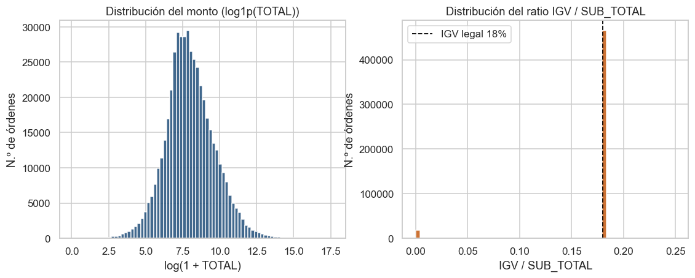
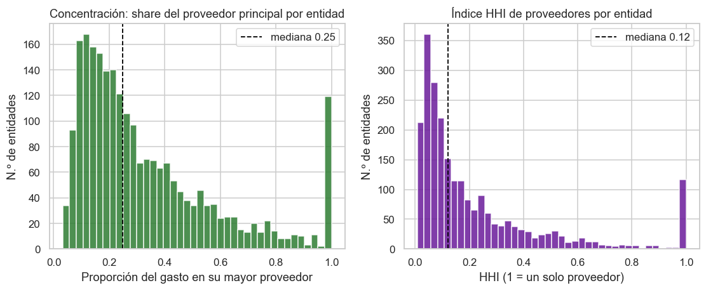
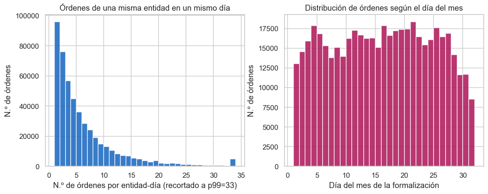
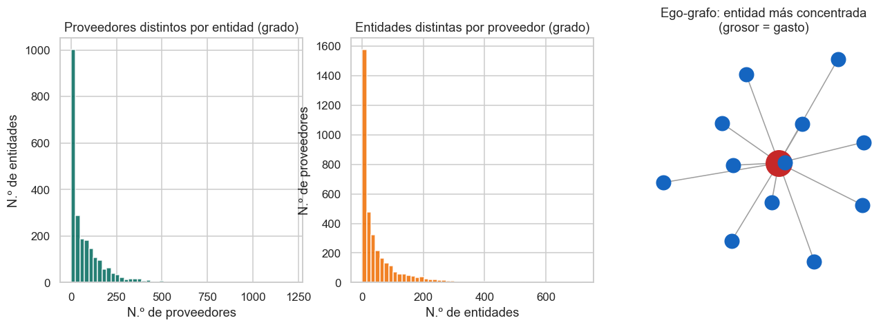
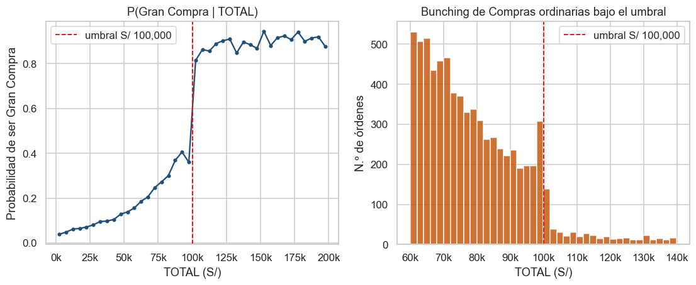
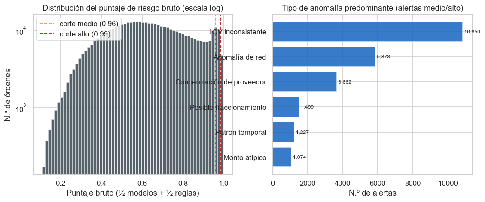
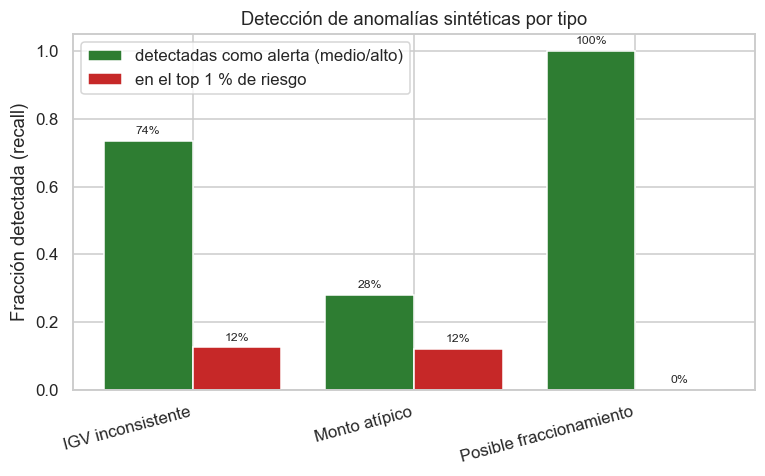
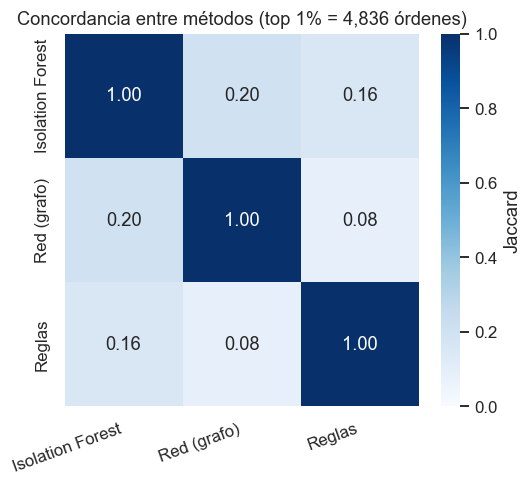

# Informe de Resultados — Módulo B: Detección de Órdenes de Compra Anómalas

_Sistema de Predicción de Órdenes de Compra (SistemaPrediccionOC). Generado el 2026-06-08 20:30._

## 1. Introducción y datos

Este informe documenta el **Módulo B** del sistema: la detección, de forma **no supervisada**, de órdenes de compra con comportamiento anómalo o de riesgo, para apoyar la transparencia y la revisión de las compras públicas de los Catálogos Electrónicos de Acuerdos Marco de PERÚ COMPRAS.

El Módulo B **reutiliza la capa de datos del Módulo A** (el dataset consolidado y limpio); no vuelve a leer ni a limpiar los CSV. Cada fila es **una orden completa** (no el detalle por producto), por lo que las anomalías se detectan a nivel de orden y de relaciones entre entidades y proveedores.

- **Órdenes válidas analizadas**: 483,692
- **Rango temporal** (FECHA_FORMALIZACIÓN): 2022-01-04 a 2026-05-31
- **Entidades**: 2,336 · **Proveedores**: 3,563

**Parámetros derivados de los propios datos** (no asumidos):

- **Umbral de fraccionamiento** (cambio a *Gran Compra*): **S/ 100,000**, descubierto por la discontinuidad de P(Gran Compra | TOTAL).
- **Tolerancia de IGV**: **±0.0050** sobre el ratio 0.18, derivada de la distribución real del ratio IGV/SUB_TOTAL.

## 2. Análisis exploratorio orientado a anomalías

### 2.1 Montos e IGV

El monto `TOTAL` tiene una **cola extremadamente larga**: la mediana es **S/ 2,690** pero el máximo llega a **S/ 44,580,303**. Por eso el modelado usa el **logaritmo** del monto (panel izquierdo), donde la distribución se vuelve aproximadamente acampanada y las verdaderas órdenes gigantes quedan en el extremo derecho.

El ratio `IGV / SUB_TOTAL` (panel derecho) está **casi siempre exactamente en 0.18** (el IGV peruano del 18 %): el 96.1 % de las órdenes cae sobre la línea. La distribución es **bimodal**: un pico nítido en 0.18 y otro en 0 (órdenes sin IGV). Con la tolerancia derivada de los datos (±0.005) quedan marcadas **18,888 órdenes inconsistentes** (3.90 %), de las cuales 18,500 tienen IGV = 0. Lo *normal* es 0.18; apartarse de ahí es la señal de anomalía de IGV.

### 2.2 Concentración de proveedor

Cada entidad reparte su gasto entre varios proveedores. Lo *habitual* es una concentración moderada: la mediana del share del **proveedor principal** es **0.25**. Pero la cola derecha es preocupante: el 10 % de las entidades dirige **más del 72%** de su gasto a un único proveedor y el 5 % supera el **99%**. Hay **136 entidades** que concentran ≥90 % en un solo proveedor. El **HHI** (panel derecho) confirma el patrón: mediana **0.12**, pero con entidades cuyo HHI se acerca a 1 (mercado cautivo). Esa cola alta es la que alimenta la señal de *concentración de proveedor*.

### 2.3 Patrones temporales

La mayoría de las entidades emite **pocas órdenes por día** (mediana de 4), pero existe una cola de jornadas con decenas de órdenes el mismo día (máximo **95** órdenes de una entidad en una sola fecha): formalizar muchas órdenes de golpe puede indicar un fraccionamiento o un cierre presupuestal apresurado. En cuanto al **día del mes** (panel derecho), se observa una **acumulación hacia el final**: el **19%** de las órdenes se formaliza en los últimos 5 días del mes y el 16% a partir del día 26. Esta concentración al cierre es un patrón temporal que el módulo registra como factor de riesgo cuando coincide con otras señales.

### 2.4 Red entidad–proveedor

La red entidad–proveedor es un grafo bipartito con **2,336 entidades**, **3,563 proveedores** y **189,825 relaciones** distintas. La mayoría de entidades trabaja con **pocos proveedores** (mediana de **36**), aunque algunas alcanzan más de 504. Del lado de los proveedores, la mayoría atiende a pocas entidades (mediana **21**), pero unos pocos son *hubs* que sirven a cientos (máximo **720** entidades). El ego-grafo muestra el caso extremo: una entidad que vuelca casi todo su gasto en un único proveedor (arista gruesa dominante), justo el tipo de relación atípica que el análisis de grafos busca aislar.

### 2.5 Punto de corte del fraccionamiento

El punto de corte del fraccionamiento **no se asumió**: se descubrió a partir de la relación real entre `TOTAL` y `TIPO_PROCEDIMIENTO`. La probabilidad de que una orden sea **Gran Compra** salta de **0.36** a **0.81** justo al cruzar **S/ 100,000** (panel izquierdo): por encima de ese monto el procedimiento competitivo se vuelve obligatorio. El panel derecho muestra el **bunching**: hay **403 Compras ordinarias** apretadas en el último 2 % por debajo del umbral frente a solo **37** apenas por encima. Esa acumulación justo debajo del límite es la huella típica de la manipulación de umbral; por eso el módulo vigila las órdenes pegadas a S/ 100,000.

## 3. Ingeniería de variables de anomalía

Se construyeron variables por orden que capturan cada comportamiento de riesgo. Todos los parámetros se derivan de los datos.

| Variable | Comportamiento que captura |
|---|---|
| `LOG_TOTAL` | Monto de la orden (en log, por la cola larga). |
| `Z_TOTAL_CAT`, `Z_TOTAL_GLOBAL` | Desviación robusta del log-monto vs su categoría y vs el global (mediana/MAD). |
| `ABS_DESV_IGV`, `FLAG_IGV` | Distancia del ratio IGV/SUB_TOTAL respecto a 0.18. |
| `SHARE_GASTO_PROV`, `SHARE_ORD_PROV` | Proporción del gasto/órdenes de la entidad dirigida a este proveedor. |
| `HHI_ENTIDAD` | Concentración (Herfindahl) de proveedores de la entidad. |
| `PROXIMIDAD_UMBRAL`, `FLAG_BAJO_UMBRAL` | Cercanía del monto al umbral de fraccionamiento, por debajo. |
| `N_ORD_VENTANA_7D/30D`, `SUMA_VENTANA_*`, `FLAG_FRACCIONAMIENTO` | Ráfaga de órdenes del par entidad–proveedor en ventanas cortas. |
| `N_ORD_ENTIDAD_DIA` | Órdenes de la entidad el mismo día. |
| `DIAS_PARA_FIN_MES`, `FLAG_CIERRE_MES` | Proximidad al cierre de mes. |
| `DIAS_ESTADO` | Días entre FECHA_FORMALIZACIÓN y FECHA_ÚLTIMO_ESTADO. |
| `LOCK_IN`, `DEP_PROV_ENTIDAD`, `FLAG_PROV_CAUTIVO`, `TAM_COMUNIDAD` | Señales del grafo entidad–proveedor. |

## 4. Modelado de la detección

Se aplicaron tres enfoques no supervisados y reproducibles (semilla fija): **Isolation Forest** y un **autoencoder** sobre las features estandarizadas, y un **análisis de grafo** de la red entidad–proveedor. Sus señales se combinan con las reglas interpretables en un puntaje de riesgo por orden.

### 4.1 Análisis de la red entidad–proveedor

El grafo bipartito tiene **5,899 nodos** y **189,825 aristas**, con **15 comunidades** (Louvain) y **309 proveedores cautivos** (atienden a una sola entidad). El proveedor más conectado sirve a 720 entidades y la entidad más diversificada usa 1,214 proveedores.

Las relaciones con mayor **candado bilateral** (lock-in) — entidad y proveedor que dependen casi exclusivamente el uno del otro — son las más atípicas:

| RUC_ENTIDAD | RUC_PROVEEDOR | gasto | n | s_ent_prov | s_prov_ent | lock_in |
|---|---|---|---|---|---|---|
| 20542575621 | 20602670849 | 1,573,567 | 46 | 0.64 | 0.90 | 0.76 |
| 20192088772 | 20601237122 | 135,070 | 1 | 1.00 | 0.56 | 0.75 |
| 20147775122 | 20600196015 | 587,583 | 1 | 0.98 | 0.56 | 0.74 |
| 20355712053 | 20608145207 | 206,406 | 6 | 0.73 | 0.69 | 0.71 |
| 20323036684 | 20604534632 | 1,273,199 | 12 | 0.22 | 1.00 | 0.47 |
| 20204050580 | 10431473351 | 19,192 | 4 | 0.67 | 0.73 | 0.70 |
| 20146920374 | 20610629670 | 69,704 | 1 | 0.20 | 1.00 | 0.44 |
| 20301053623 | 20605917993 | 1,513,382 | 3 | 0.42 | 0.95 | 0.63 |

### 4.2 Distribución del riesgo y tipos de anomalía

El **puntaje bruto** combina, a partes iguales, los detectores no supervisados (Isolation Forest + autoencoder) y el máximo de las señales interpretables. Su distribución (panel izquierdo, escala logarítmica) concentra la masa en valores moderados y **adelgaza marcadamente hacia la derecha**: solo una cola fina supera los cortes derivados de la propia distribución (**0.96** para *medio*, el percentil 95, y **0.99** para *alto*, el percentil 99). El puntaje final de cada orden se reexpresa como **percentil** [0, 1] para que sea fácil de leer (*'más anómala que el X % de las órdenes'*). Los cortes dejan **4,837 alertas de nivel alto** y **19,348 de nivel medio**. Por tipo predominante (panel derecho), el más frecuente es **IGV inconsistente**: cada orden recibe el tipo en el que resulta más extrema respecto al resto, pero su *motivo* enumera todas las señales que disparó, de modo que el revisor ve el cuadro completo.

## 5. Evaluación sin etiquetas

### 5.1 precision@k (validez aparente de las alertas)

| k | precisión@k (respaldo por señal interpretable) |
|---|---|
| 20 | 100% |
| 50 | 100% |
| 100 | 100% |

Las alertas de mayor puntaje están respaldadas por señales interpretables, no solo por el modelo. Estas son las **10 alertas de mayor riesgo** para inspección manual:

| ORDEN_ELECTRONICA | ENTIDAD | PROVEEDOR | TOTAL | TIPO_ANOMALIA | PUNTAJE_RIESGO | NIVEL | MOTIVO |
|---|---|---|---|---|---|---|---|
| OCAM-2024-470-348-0 | EJERCITO PERUANO | ARTI GROUP S.A.C. | 310,951 | Anomalía de red | 1.0 | alto | Monto s/ 310,951 muy por encima de lo habitual en su categoría; 16 órdenes del par en 7 días sumando s/ 799,43… |
| OCAM-2023-1058-22-0 | OFICINA DE GESTIÓN DE SERVICIOS DE SALUD ALTO MAYO | RUIZ TORRES ISABEL MERCEDES | 98,600 | Anomalía de red | 1.0 | alto | Ratio igv 0.000 (esperado 0.18); monto pegado al umbral de s/ 100,000.… |
| OCAM-2022-301691-1-0 | MUNICIPALIDAD DISTRITAL DE SAN JUAN DEL ORO | SELVALEVA S.R.L. | 92,015 | Concentración de proveedor | 1.0 | alto | La entidad concentra el 100% de su gasto en este proveedor; monto pegado al umbral de s/ 100,000.… |
| OCAM-2024-301485-1-0 | MUNICIPALIDAD DIST.SAN CRISTOBAL-CALACOA | 4G CONSULTORES Y CONSTRUCTORES EMPRESA INDIVIDUAL DE RESPONSABILIDAD LIMITADA | 587,583 | Anomalía de red | 1.0 | alto | Monto s/ 587,583 muy por encima de lo habitual en su categoría; la entidad concentra el 98% de su gasto en est… |
| OCAM-2024-470-344-0 | EJERCITO PERUANO | ARTI GROUP S.A.C. | 213,321 | Anomalía de red | 1.0 | alto | Monto s/ 213,321 muy por encima de lo habitual en su categoría; 11 órdenes del par en 7 días sumando s/ 374,43… |
| OCAM-2022-500183-8-0 | EMPRESA MUNICIPAL DE SERVICIO ELECTRICO DE TOCACHE S.A. | CORPORACION J&V E.I.R.L. | 99,995 | Posible fraccionamiento | 1.0 | alto | 3 órdenes del par en 7 días sumando s/ 299,985 (umbral s/ 100,000).… |
| OCAM-2026-470-192-0 | EJERCITO PERUANO | ARTI GROUP S.A.C. | 112 | Anomalía de red | 1.0 | alto | 5 órdenes del par en 7 días sumando s/ 514,629 (umbral s/ 100,000).… |
| OCAM-2025-301422-54-0 | MUNICIPALIDAD PROVINCIAL DE MAYNAS | GRUPO EMPRESARIAL COMPANY E.I.R.L. | 4,500 | Posible fraccionamiento | 1.0 | alto | Ratio igv 0.000 (esperado 0.18); 23 órdenes del par en 7 días sumando s/ 285,480 (umbral s/ 100,000).… |
| OCAM-2025-301422-55-0 | MUNICIPALIDAD PROVINCIAL DE MAYNAS | GRUPO EMPRESARIAL COMPANY E.I.R.L. | 4,500 | Posible fraccionamiento | 1.0 | alto | Ratio igv 0.000 (esperado 0.18); 24 órdenes del par en 7 días sumando s/ 289,980 (umbral s/ 100,000).… |
| OCAM-2024-904-36-0 | PROGRAMA REGIONAL DE RIEGO Y DRENAJE | GRUPO FER. CONS SOCIEDAD ANONIMA CERRADA | 97,475 | Anomalía de red | 1.0 | alto | 2 órdenes del par en 7 días sumando s/ 112,163 (umbral s/ 100,000); relación entidad–proveedor bilateralmente … |

### 5.2 Inyección de anomalías sintéticas (estimación de recall)

Se inyectaron casos artificiales y se volvió a ejecutar todo el pipeline. La tabla muestra qué fracción de cada tipo quedó marcada como alerta:

| Tipo sintético | n | Recall (alerta) | Recall (top 1%) | Puntaje mediano |
|---|---|---|---|---|
| IGV inconsistente | 200 | 74% | 12% | 0.964 |
| Monto atípico | 200 | 28% | 12% | 0.896 |
| Posible fraccionamiento | 198 | 100% | 0% | 0.983 |

**Recall global** (cualquier anomalía sintética marcada como alerta): **67%** de 598 casos inyectados.

### 5.3 Concordancia entre métodos (robustez)

Tomando el **top 1%** de cada método (4,836 órdenes), el solapamiento de Jaccard entre Isolation Forest y las reglas es **0.16**, entre Isolation Forest y la red **0.20**, y entre la red y las reglas **0.08**. **517 órdenes** aparecen en el top de los **tres** métodos a la vez: son las de mayor consenso y, por tanto, las más robustas. Un solapamiento parcial es lo esperable y deseable: cada método capta un aspecto distinto (global, relacional, de regla), y su intersección concentra los casos más sólidos.

### 5.4 Limitaciones

- El enfoque es **no supervisado**: no hay etiquetas de fraude, así que los puntajes son **relativos a esta población** y miden *rareza*, no irregularidad probada.
- Una orden anómala puede tener una explicación legítima (una gran compra puntual, una entidad pequeña con un único proveedor disponible, un bien exento de IGV).
- El recall estimado proviene de anomalías **sintéticas**, que pueden ser más fáciles de detectar que las reales; debe leerse como cota optimista.
- Toda alerta es un **insumo para revisión experta**, no una conclusión.

## 6. Salida de alertas

La tabla de alertas rankeada se exportó a `outputs/resultados/alertas.csv` (**24,185 alertas** de nivel medio/alto), con el id de la orden, entidad, proveedor, tipo de anomalía, puntaje, nivel y motivo.
