# Informe de Resultados — Módulo A: Pronóstico del Gasto en Órdenes de Compra

_Sistema de Predicción de Órdenes de Compra (SistemaPrediccionOC). Generado el 2026-06-07 01:13._

## 1. Introducción

Este informe documenta el **Módulo A** del sistema: el pronóstico del gasto público mensual en las **Órdenes de Compra de los Catálogos Electrónicos de Acuerdos Marco** de la Central de Compras Públicas del Perú (PERÚ COMPRAS). Cada registro es una orden de compra de bienes emitida por una entidad pública a un proveedor, con su monto y convenio.

La variable a pronosticar es el **gasto total mensual** (suma de `TOTAL`), agregado por **`FECHA_FORMALIZACION`**. El informe reúne el análisis exploratorio con sus interpretaciones y la comparación de modelos con su conclusión.

Los datos abarcan **53 meses** (de 202201 a 202605) e incluyen **483,889 órdenes** consolidadas desde 53 archivos CSV mensuales.

## 2. Análisis Exploratorio de Datos (EDA)
### 2.1 Resumen general
- **Archivos leídos:** 53 de 53 encontrados (omitidos: ninguno).
- **Meses cubiertos:** 53 (de 202201 a 202605).
- **Codificaciones detectadas:** {'latin-1': 52, 'utf-8': 1}.
- **Filas consolidadas (crudo):** 483,889.
- **Filas válidas tras limpieza:** 483,692.
- **Entidades distintas:** 3,244 | **Proveedores distintos:** 3,586 | **Categorías (ACUERDO_MARCO):** 72.

### 2.2 Calidad de los datos
- **Duplicados exactos:** 0. **Duplicados por ORDEN_ELECTRONICA:** 0.
- **Órdenes sin fecha de formalización (descartadas):** 0.
- **Órdenes excluidas por estado** ('RESUELTA', 'ORDEN DE COMPRA NULA'): 197.
- **Consistencia contable:** se verificó que TOTAL = SUB_TOTAL + IGV.
- **Columnas con valores nulos (solo auxiliares/enlaces):**
    - `DESCRIPCION_CESION_DERECHOS`: 100.0%
    - `DOCUMENTO_ESTADO_OCAM`: 99.41%
    - `DESCRIPCION_ESTADO`: 81.24%
- **Outliers de monto** (criterio IQR×3, límite ≈ S/ 29,310): 42,048 órdenes por encima; máximo S/ 44,580,303. No se eliminan: son grandes compras reales.

### 2.3 Figuras e interpretaciones

**Figura 1. Evolucion gasto ordenes**

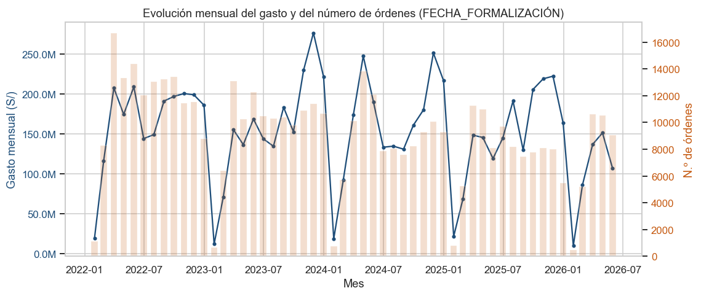

_La serie cubre 53 meses. El gasto total acumulado es de **S/ 8,078 millones**, con un promedio de **S/ 152.4 millones/mes**. El mes de mayor gasto fue 2023-11 (S/ 276.7M) y el de menor 2026-01 (S/ 9.7M). Se observa una caída pronunciada y recurrente cada inicio de año (enero), coherente con el calendario de ejecución presupuestal pública peruana, y una recuperación entre marzo y diciembre. El número de órdenes (barras) acompaña al gasto, aunque en los últimos años el gasto se sostiene con menos órdenes (ticket promedio creciente)._

**Figura 2. Distribucion total**

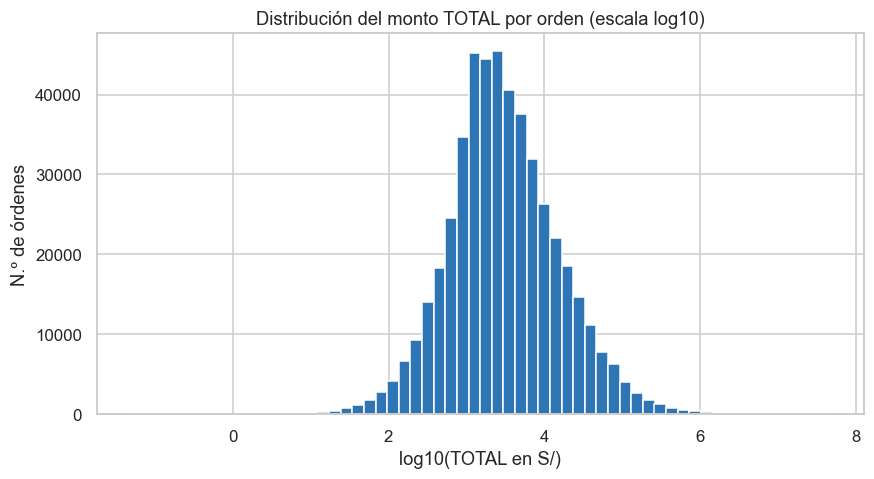

_El monto por orden está **fuertemente sesgado a la derecha**: la mediana es **S/ 2,690** pero la media es **S/ 16,701**, señal de una cola larga de grandes compras (máximo S/ 44,580,303). El histograma en escala logarítmica muestra una forma aproximadamente acampanada, típica de montos con distribución log-normal. Esta asimetría justifica analizar el GASTO AGREGADO mensual (más estable) en lugar de los montos individuales para el pronóstico._

**Figura 3. Gasto por categoria**

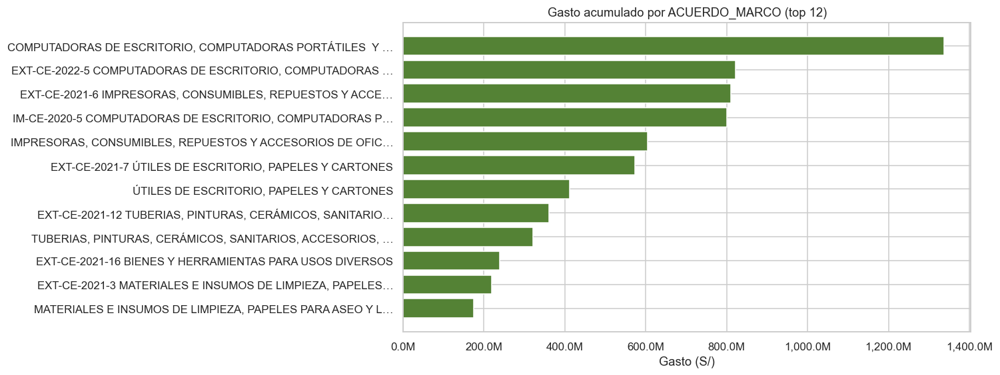

_Existen **72 valores distintos de ACUERDO_MARCO** (con variaciones de etiqueta entre años: algunos llevan el código del convenio, p. ej. 'EXT-CE-2021-7', y otros solo la descripción). Las 12 categorías mostradas concentran el **82.6%** del gasto. Dominan los bienes de oficina —útiles de escritorio, impresoras y consumibles— seguidos de materiales de limpieza y equipos de cómputo. Esto orienta una eventual serie por categoría, aunque el foco del Módulo A es el gasto total._

**Figura 4. Gasto por tipo procedimiento**

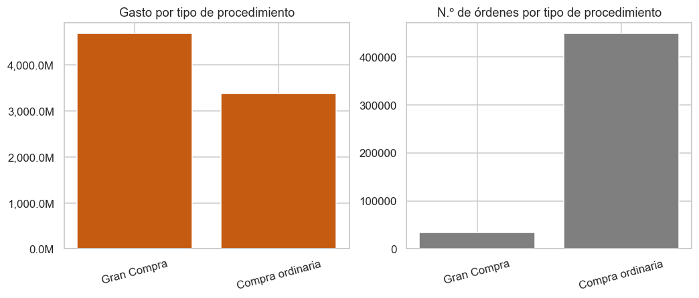

_En **gasto**, el tipo de procedimiento que más concentra es **'Gran Compra'** (58% del total), mientras que en **número de órdenes** domina **'Compra ordinaria'** (93% de las órdenes). Es decir, hay muchas órdenes ordinarias de monto moderado y pocas 'Gran Compra' de ticket muy elevado; estas últimas, al ser grandes y esporádicas, pueden introducir saltos puntuales en el gasto mensual y conviene tenerlas presentes al interpretar picos de la serie._

**Figura 5. Top entidades proveedores**

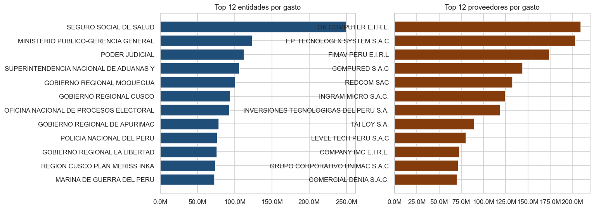

_Hay **3,244 entidades** compradoras y **3,586 proveedores** distintos. El gasto está relativamente concentrado: la entidad líder es 'SEGURO SOCIAL DE SALUD' y el proveedor líder es 'OK COMPUTER E.I.R.L.'. Esta concentración es relevante para el futuro módulo de detección de anomalías, pero no condiciona el pronóstico agregado._

**Figura 6. Estacionalidad por mes**

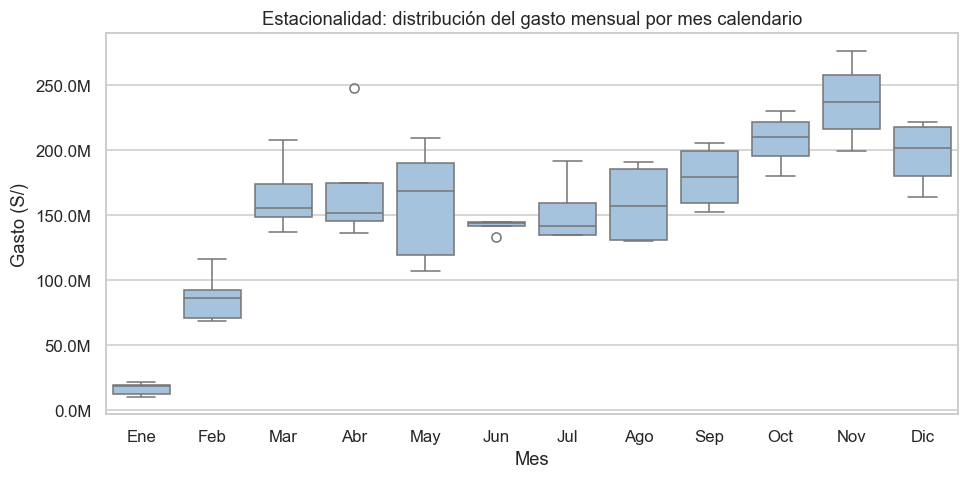

_El boxplot por mes calendario confirma una **estacionalidad anual marcada y consistente**: **Ene** es sistemáticamente el mes de menor gasto (S/ 16.1M en promedio) y **Nov** uno de los más altos (S/ 237.4M). Como el patrón se repite en todos los años, NO se trata de meses incompletos sino de estacionalidad real. Esto favorece modelos con componente estacional de periodo 12 (SARIMA, naive estacional, variables de mes)._

**Figura 7. Descomposicion serie**

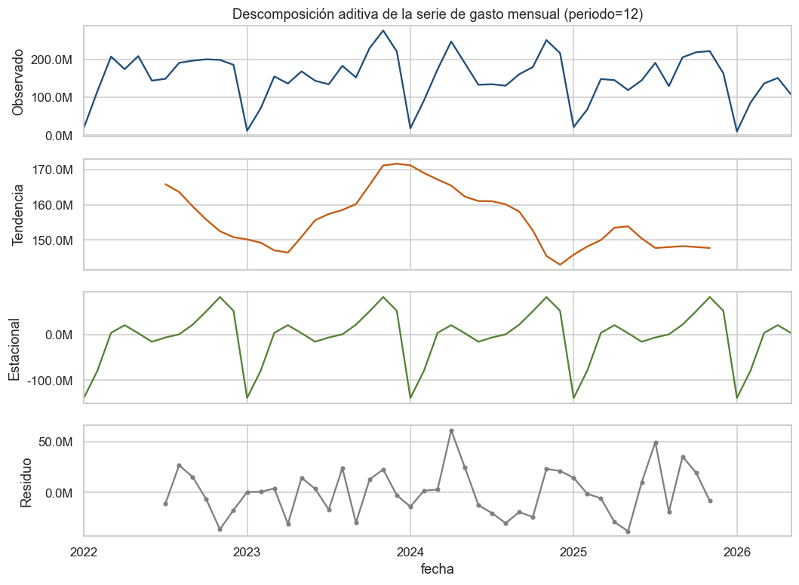

_La descomposición separa tres componentes. La **tendencia** es estable o descendente a lo largo del periodo. La **componente estacional** tiene una amplitud de S/ 221.8M entre el mes más bajo y el más alto, confirmando la estacionalidad anual. El **residuo** recoge el ruido y eventos puntuales (p. ej. grandes compras), sin un patrón evidente, lo que indica que tendencia + estacionalidad explican buena parte de la variación._

**Figura 8. Deteccion meses incompletos**

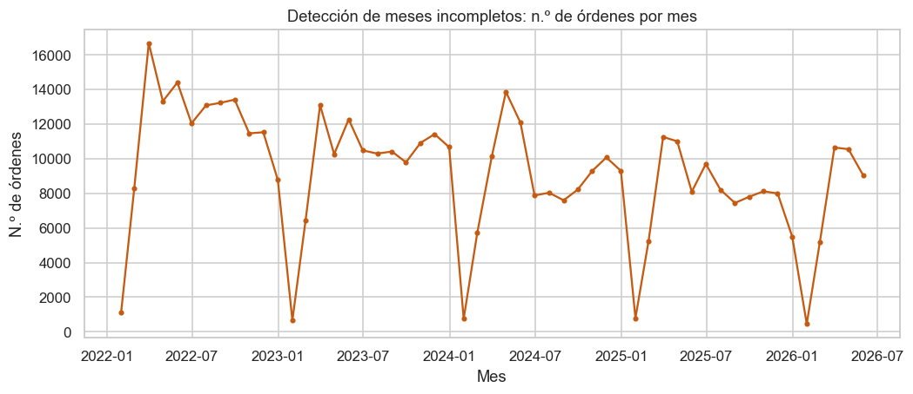

_La detección de incompletitud compara, mes a mes desde el final, el número de órdenes contra el mismo mes del año anterior (controlando la estacionalidad). **Ningún mes de la cola resultó incompleto** (último mes 2026-05: 1.12× respecto al año previo): el conteo de órdenes del último mes es comparable al del mismo mes del año anterior, por lo que se conservan todos los meses. La fuerte caída de enero NO se recorta porque se repite cada año (estacionalidad real, no falta de datos)._

## 3. Modelado del pronóstico
Los modelos se evaluaron con **validación de origen móvil** (rolling-origin) sobre **6 orígenes**, cada uno con horizonte de 6 meses: se entrena con todo lo anterior y se promedia el error entre orígenes. Esto es más robusto que un holdout único, que con esta serie contiene un solo enero y tiene alta varianza. Todas las semillas se fijaron en 42 para reproducibilidad.

La **métrica primaria de selección es WAPE** (error absoluto ponderado por monto, Σ|e|/Σ|y|) y **MASE** (error relativo al naive estacional). Ambas son robustas al *trough* de enero, donde el MAPE explota por dividir entre un denominador casi-cero (~S/ 10 M frente a ~S/ 150 M de media). El MAPE y el sMAPE se reportan como secundarios.

El SARIMA seleccionado automáticamente por AIC fue **SARIMA(1, 0, 0)x(0, 1, 0, 12)**.

### 3.1 Comparación de modelos (backtesting de origen móvil)

| Modelo | WAPE (%) | MASE | MAPE (%) | sMAPE (%) | MAE (S/) | RMSE (S/) | MPE (%) |
|---|---|---|---|---|---|---|---|
| Ensemble ⭐ | 16.5 | 0.75 | 28.0 | 23.6 | 24,319,489 | 28,985,223 | -13.5 |
| ETS | 17.4 | 0.78 | 24.4 | 21.5 | 25,302,705 | 30,768,096 | -13.8 |
| Estacional drift | 18.0 | 0.84 | 29.4 | 26.2 | 27,030,989 | 33,631,720 | -6.4 |
| Naive estacional | 19.0 | 0.86 | 32.3 | 25.9 | 27,870,309 | 32,462,753 | -18.0 |
| SARIMA | 19.5 | 0.89 | 33.0 | 26.2 | 28,713,065 | 33,198,770 | -20.3 |
| LightGBM | 20.9 | 0.93 | 46.7 | 30.5 | 30,125,818 | 33,156,464 | -33.4 |
| Descompuesto | 21.4 | 0.96 | 53.9 | 33.1 | 31,072,158 | 37,137,781 | -38.8 |
| XGBoost | 24.4 | 1.09 | 51.0 | 36.8 | 35,201,961 | 39,555,994 | -28.6 |
| LSTM | 38.9 | 1.66 | 66.2 | 41.4 | 53,607,271 | 62,937,146 | -57.6 |
| Transformer | 47.5 | 2.05 | 206.5 | 58.8 | 66,125,553 | 79,402,712 | -170.0 |
| Naive | 57.1 | 2.39 | 302.0 | 55.8 | 77,267,664 | 92,367,305 | -284.1 |

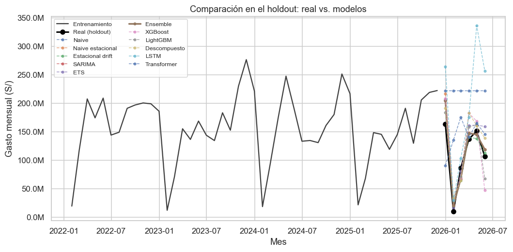

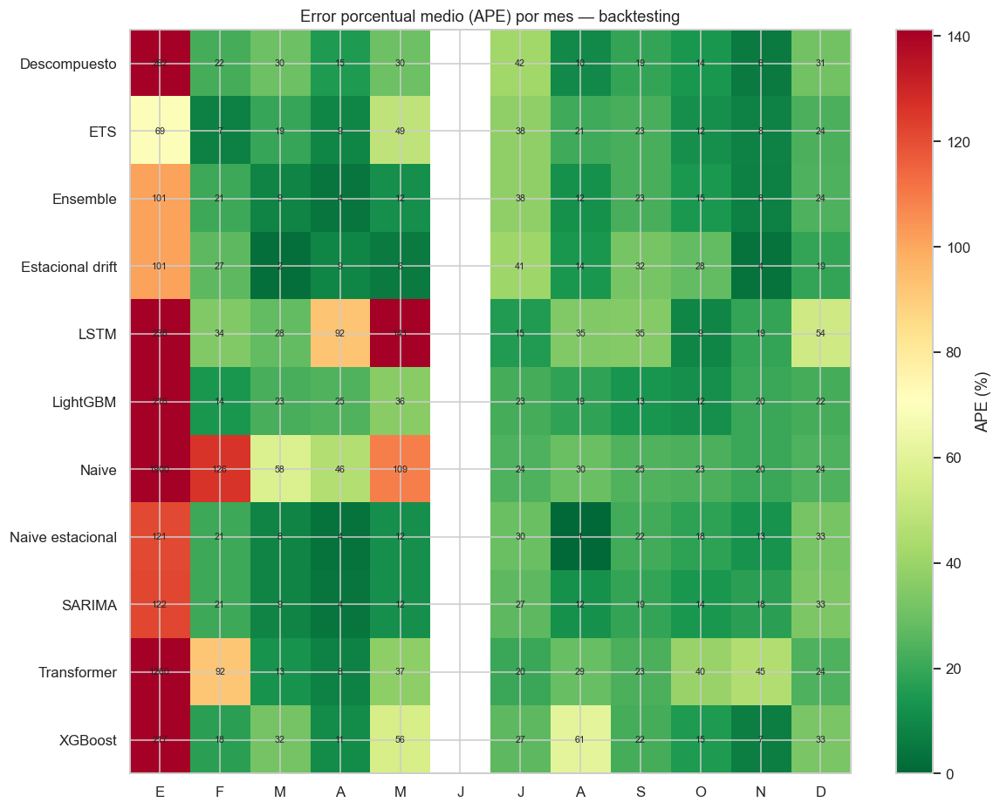

_El heatmap confirma el diagnóstico: **enero concentra el grueso del error porcentual** en todos los modelos (denominador casi-cero), mientras que el resto del año es mucho más predecible. Por eso WAPE/MASE describen mejor el valor real del modelo para la planificación presupuestal agregada._

_El mejor modelo es **Ensemble** (menor WAPE). En el backtest alcanza **WAPE 16.5%**, **MASE 0.75** (un MASE < 1 indica que supera al naive estacional) y un MAE de **S/ 24.32 millones** (~22.3% del gasto mensual medio). Su MAPE es **28.0%**, inflado por enero como se explicó._

### 3.2 Comparación de granularidades (diaria/semanal → mensual)

Se entrenaron modelos LightGBM a nivel **diario** y **semanal** (recuperando tamaño muestral: de ~50 puntos mensuales a ~1 600 diarios) y se agregaron sus pronósticos a mensual para medirlos con la misma vara.

| Enfoque | WAPE (%) | MASE | MAPE (%) | MPE (%) |
|---|---|---|---|---|
| Diario→mensual (LightGBM) | 28.8 | 1.10 | 34.0 | -24.9 |
| Semanal→mensual (LightGBM) | 35.1 | 1.44 | 64.6 | -33.7 |

_Recuperar tamaño muestral con granularidad fina **no rompe el techo del error**: agregar a mensual reacumula la incertidumbre diaria. El mejor enfoque sigue siendo el mensual (**Ensemble**, WAPE 16.5%). La granularidad fina es útil para el calendario y el análisis intra-mes, no para bajar el error mensual._

### 3.3 ¿Redes neuronales? Justificación del trade-off
Se incluyeron una **LSTM** (WAPE 38.9%) y un **Transformer** (WAPE 47.5%) sobre la serie única. Ambos quedan **muy por detrás** del mejor modelo estadístico (**Ensemble**, WAPE 16.5%), confirmando el diagnóstico:

- Con ~50 puntos mensuales, una red tiene más parámetros que muestras → **sobreajuste** garantizado. El Transformer, sin sesgo inductivo temporal, es el peor de todos.
- A nivel diario (~1 600 puntos) una red se vuelve entrenable, pero los árboles de gradiente con calendario siguen siendo el baseline a batir, a ~1/100 del costo (CPU/minutos vs. GPU/horas) y con mejor interpretabilidad (SHAP).
- El **único** escenario donde el Deep Learning sería claramente superior es un **modelo global** que aprenda de las ~95 categorías (`ACUERDO_MARCO`) a la vez (DeepAR/TFT/N-BEATS global): ahí 95 × ~1 600 ≈ 150 mil secuencias sí justifican la capacidad. Es la vía recomendada a futuro, no para esta serie agregada.

**Conclusión:** para reducir el error, la palanca son los **datos y las features**, no la capacidad de la red.

### 3.4 Pronóstico hacia adelante
Con **Ensemble** reentrenado sobre toda la serie se pronostican los próximos **6 meses** (2026-06 a 2026-11), con intervalo de confianza al 95%.

| Mes | Pronóstico (S/) | Límite inferior | Límite superior |
|---|---|---|---|
| 2026-06 | 131,392,861 | 74,582,867 | 188,202,854 |
| 2026-07 | 161,601,228 | 104,791,234 | 218,411,222 |
| 2026-08 | 129,890,892 | 73,080,899 | 186,700,886 |
| 2026-09 | 184,289,292 | 127,479,299 | 241,099,286 |
| 2026-10 | 200,796,257 | 143,986,264 | 257,606,251 |
| 2026-11 | 229,712,994 | 172,903,001 | 286,522,988 |

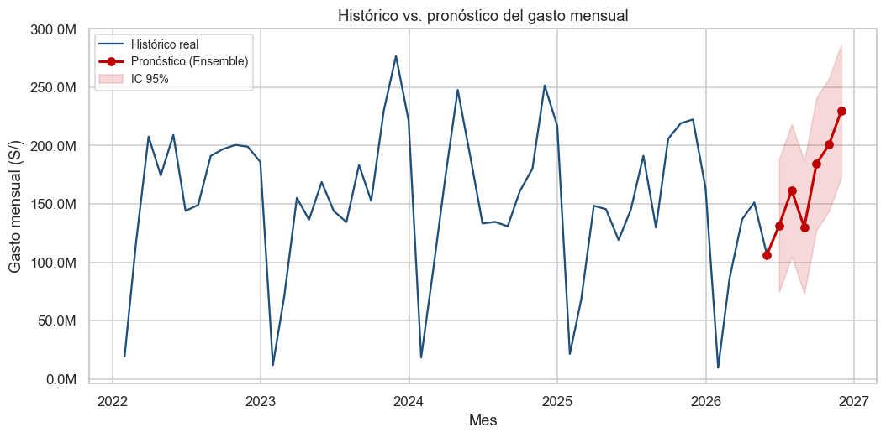

_Se proyecta un gasto acumulado de **S/ 1,038 millones** en los próximos 6 meses. El pronóstico reproduce el patrón estacional histórico (meses altos y bajos) y el intervalo de confianza refleja la incertidumbre: cuanto más ancho, mayor variabilidad esperada. Conviene recalibrar el modelo a medida que ingresen nuevos meses de datos._

## 4. Conclusiones del Módulo A
- El gasto en órdenes de compra de los Acuerdos Marco muestra una **estacionalidad anual fuerte** (mínimos en enero–febrero) y una tendencia de fondo a la baja.
- Bajo backtesting de origen móvil, **Ensemble** es el mejor modelo (WAPE 16.5%, MASE 0.75): con él **no se alcanza** el objetivo de error < 10% con los datos disponibles.
- **Enero es el límite estructural del MAPE**: su gasto casi-cero hace que cualquier error absoluto pequeño se traduzca en un error porcentual enorme. Por eso la métrica de negocio es WAPE/MASE, no el MAPE.

**Diagnóstico de por qué el error no baja de ~16.5%** (techo empírico, igual en granularidad mensual, semanal y diaria): el límite **no es el algoritmo** (los modelos complejos pierden frente a los simples), sino la **información disponible**. La serie agregada solo conoce su propio pasado, y el gasto público depende de factores exógenos que no están en los datos.

**Para romper el 10% se necesita más SEÑAL, no más modelo:**
1. **Variables exógenas**: presupuesto asignado por entidad (PIA/PIM), calendario de ejecución, licitaciones en curso, indicadores macro. Es la palanca de mayor impacto.
2. **Más historia** (la serie tiene ~4 años; con 8–10 los modelos estacionales ganan precisión).
3. **Modelo global por categoría** (~95 series `ACUERDO_MARCO`): habilita cross-learning y, ahí sí, Deep Learning (TFT/N-BEATS) competitivo.
4. **Reencuadre de la meta**: para planificación presupuestal, WAPE/MASE (no MAPE) y un horizonte agregado (trimestral) son las métricas correctas; el MAPE mensual con enero es una vara estructuralmente inalcanzable.

- El pipeline es **reproducible** (semillas fijas, rutas relativas) y deja listos los artefactos para los siguientes módulos del sistema.
